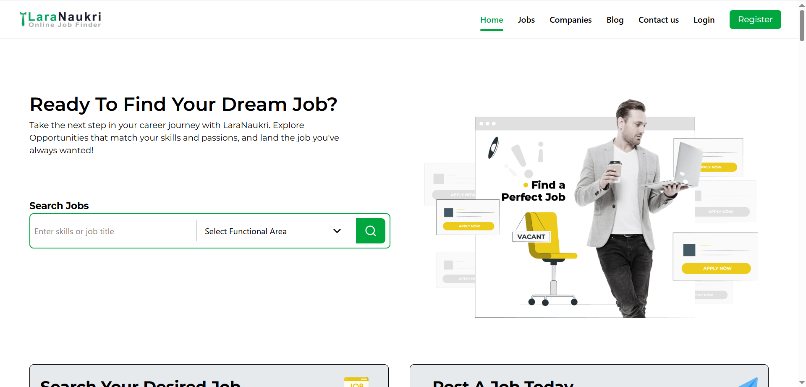
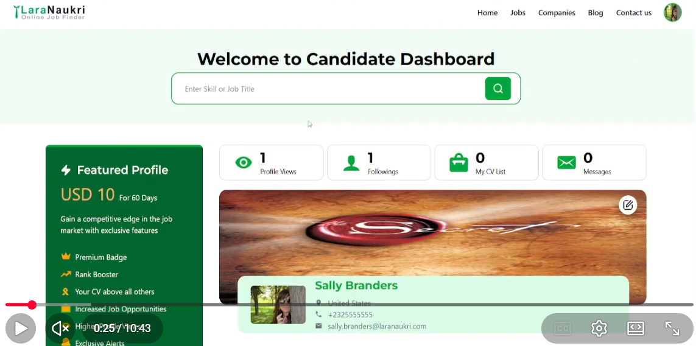
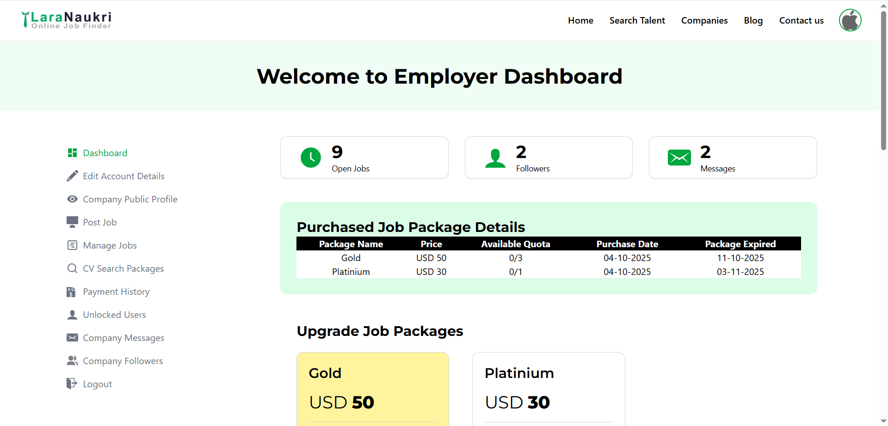
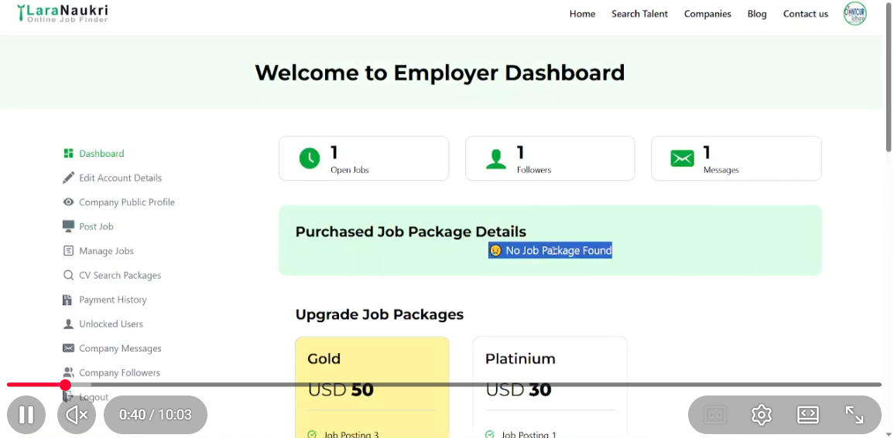
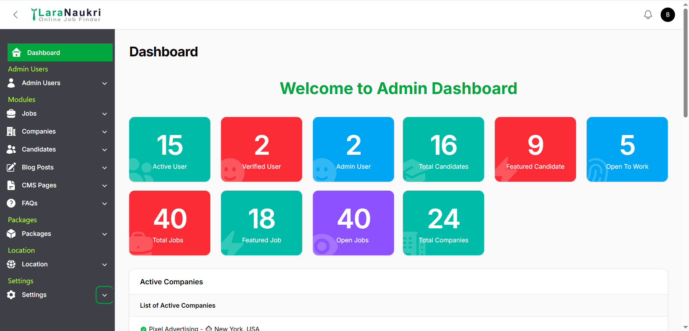
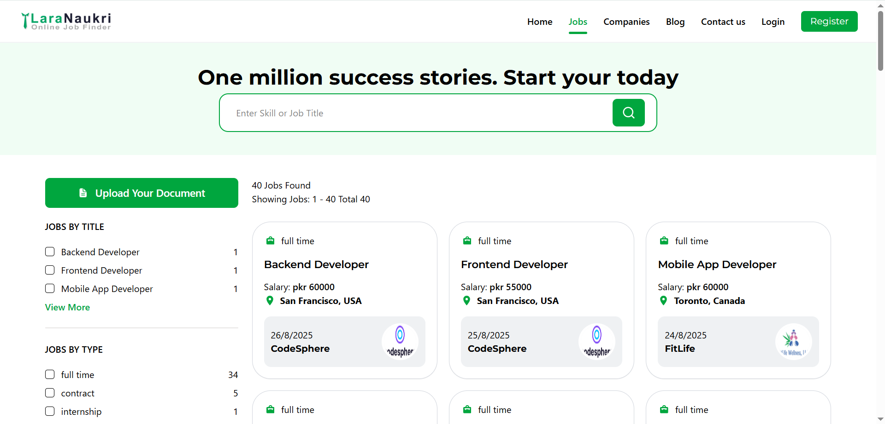

# 🌐 Laranaukri

 
 
 


---



**Laranaukri** is a modern, mobile-friendly, and AI-powered Job Portal System built with **Laravel 12**, **Inertia.js**, **React 18+**, and **Filament 4**.

It delivers a full recruitment ecosystem for **Job Seekers**, **Job Providers**, and **Administrators** — enhanced by **AI-driven automation**, a **responsive mobile-friendly design**, and a **powerful Filament admin interface**.

---

## 🛠️ Tech Stack

| Layer              | Technology                         |
| ------------------ | ---------------------------------- |
| **Backend**        | Laravel 12                         |
| **Frontend**       | React 18+ with Inertia.js          |
| **Admin Panel**    | Filament 4                         |
| **Database**       | MySQL                              |
| **Styling**        | Tailwind CSS                       |
| **AI Integration** | Hugging Face API                   |
| **Compatibility**  | Mobile-friendly, Responsive Design |
| **Deployment**     | Shared hosting & Cloud supported   |

---

## 🚀 Features

### 👨‍💼 Job Seeker


Manage all details of job seekers — including professional profiles, education, skills, and resumes.  
Job seekers can build dynamic profiles and manage every career detail easily.

**Key Features**

- Free registration and editable profiles
- Create and manage online resumes
- Add projects, experience, education, skills, and languages
- Upload multiple resumes
- Apply for jobs instantly
- Advanced job search and filtering
- Job alerts and favorites management
- View and follow companies
- Messaging between seekers and employers

**10-min Candidate Dashboard Walkthrough**

[](https://www.youtube.com/watch?v=qbbXcB5Y5sU)

---

### 🏢 Job Provider / Company



Employers can efficiently manage job postings and candidates using a comprehensive dashboard.

**Key Features**

- Free registration and company profile management
- Post, edit, and delete job listings
- Employer package management
- Manage posted jobs and candidate applications
- Shortlist candidates
- Resume search and filtering
- View detailed candidate profiles and download resumes
- Manage company followers and communication

**10-min Employer Dashboard Walkthrough**

[](https://www.youtube.com/watch?v=oLeBFrUnpPc)

---

### 🧑‍💻 Administrator



The **Filament Admin Panel** offers a sleek and powerful backend for full platform management.

**Key Features**

- Manage admin users and roles
- Manage and import jobs in bulk
- Manage companies and job seekers
- Manage CMS pages and SEO metadata
- Manage FAQs, blogs, testimonials, and multi-language content
- Manage countries, states, and cities
- Configure employer and seeker packages
- Update global site settings and appearance

**10-min Admin Dashboard Walkthrough**

[](https://www.youtube.com/watch?v=lGd-wwMdXpM)

---

### 🔍 Job Search Module



Browse current vacancies with full job details such as company, skills, and experience required.  
Includes advanced filters and sorting for a superior job search experience.

---

## 🤖 AI-Powered Features

Laranaukri integrates **AI capabilities via Hugging Face APIs** to automate and personalize user experiences.

### ✨ AI Job Description Generator

Generate detailed, SEO-optimized job descriptions instantly by providing only a job title or keywords.

### 📄 AI Resume Analyzer

Evaluate uploaded resumes and receive:

- Resume quality score
- Keyword optimization insights
- Practical improvement suggestions

### 💬 AI Career Coach

An intelligent assistant that provides:

- Personalized career guidance
- Resume enhancement tips
- Skill development recommendations
- Job matching insights

---

## ⚙️ Installation

> **Note:** This demo does not include direct job seeker registration.  
> A pre-built **`laranaukri.sql`** database file is provided for setup.

### Prerequisites

Ensure you have:

- PHP ≥ 8.3
- Composer
- Node.js ≥ 18
- MySQL

### Steps

1. **Clone the repository**

   ```bash
   git clone https://github.com/your-username/laranaukri.git
   cd laranaukri

   ```

2. **Install PHP dependencies**

   ```bash
   composer install

   ```

3. **Install Node dependencies**

   ```bash
   npm install
   npm run build

   ```

4. **Set up environment**

   ```bash
   cp .env.example .env
   php artisan key:generate

   ```

5. **Import the database**

   ```bash
   Create a new MySQL database
   Import laranaukri.sql

   ```

6. **Update .env with database credentials**

   ```bash
   DB_DATABASE=laranaukri
   DB_USERNAME=your_username
   DB_PASSWORD=your_password

   ```

7. **Link storage**

   ```bash
   php artisan storage:link

   ```

8. **Upgrade Filament assets**

   ```bash
   php artisan filament:upgrade

   ```

9. **Start the local development server**

   ```bash
   composer run dev

   ```

10. **Visit your app at:**
    ```bash
    👉 http://127.0.0.1:8000
    ```

## Folder Structure

```bash
    laranaukri/
        ├── app/ # Laravel backend (models, controllers, jobs, etc.)
        ├── database/ # Migrations and seeders
        ├── public/ # Public assets
        ├── resources/
            │ ├── js/ # React + Inertia frontend components
            │ ├── views/ # Blade views (Filament + layouts)
            │ └── css/ # Tailwind styles
        ├── routes/ # Web, API, and Filament routes
        ├── storage/ # File uploads and cache
        └── .env.example # Environment configuration example
```

## Author

Developed by Tabish Sajwani 🌐 https://tabishsajwani.com
